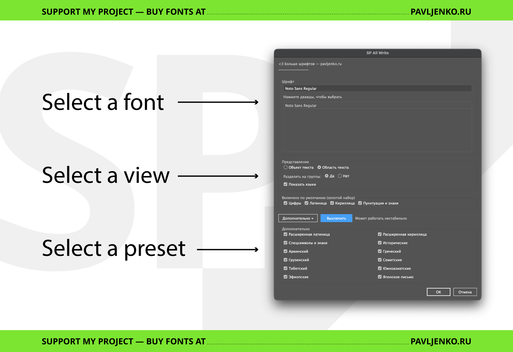
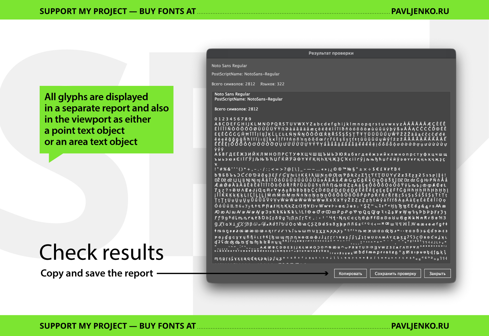
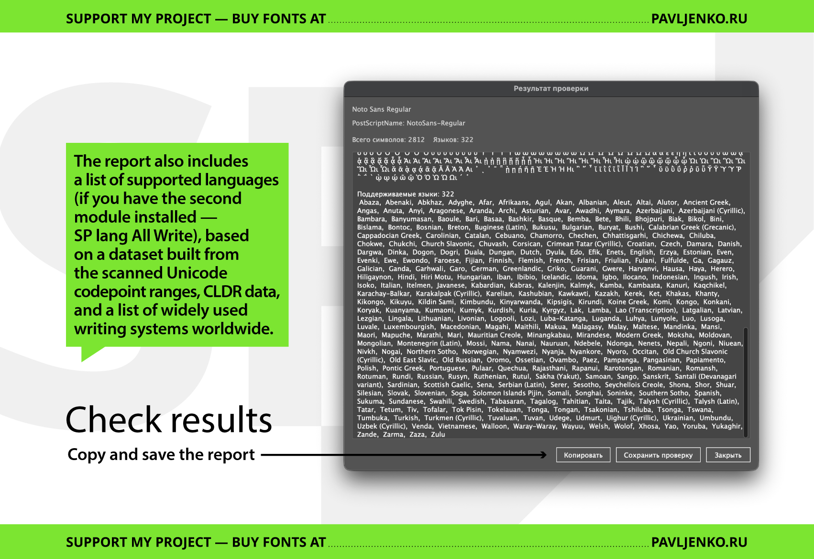
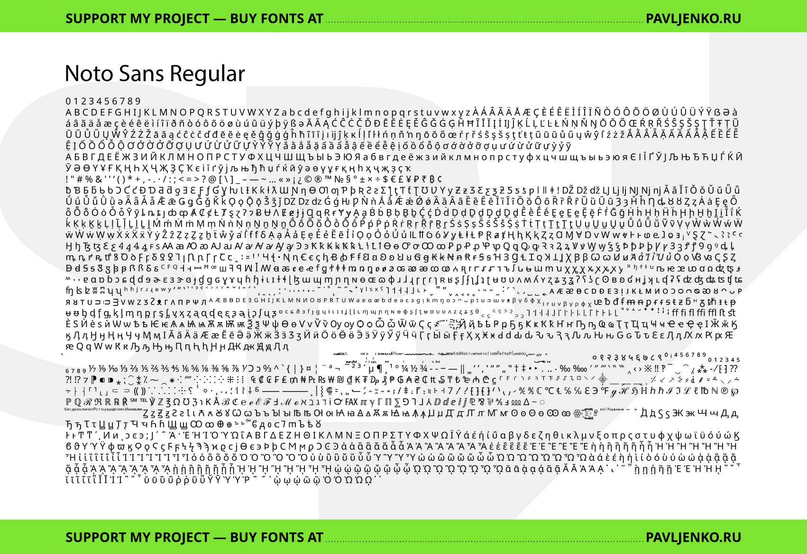
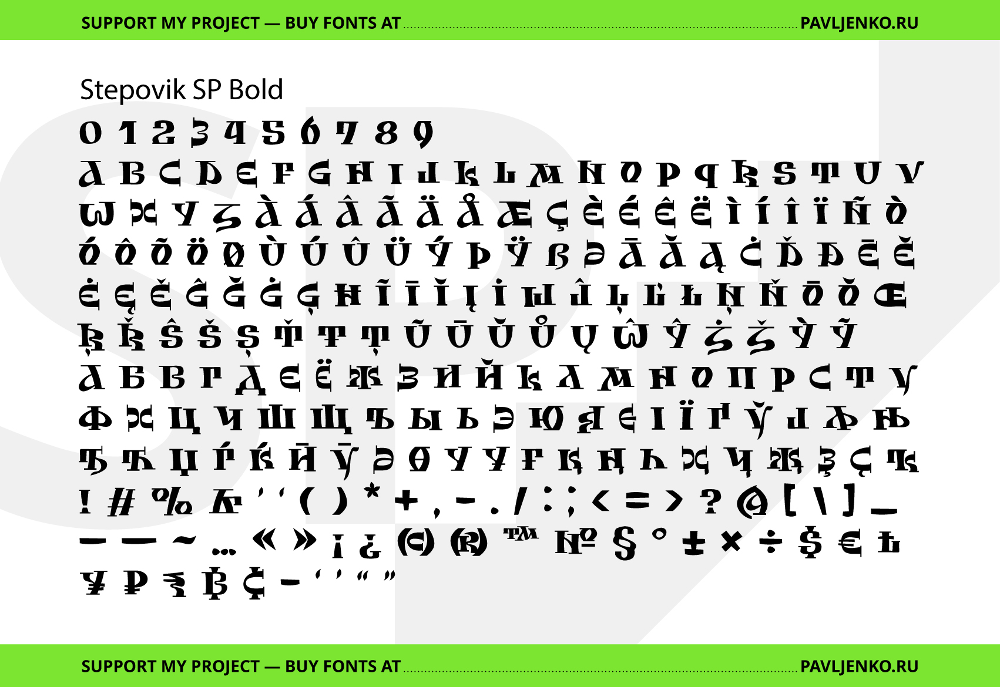

# SP All Write — Adobe Illustrator Script to Output Font Glyphs

**SP All Write 1.0.jsx** is an ExtendScript for Adobe Illustrator that builds a text object containing the glyphs your font **actually renders** in Illustrator. It’s designed for type designers and graphic designers who need a fast “what’s inside this font?” view прямо на артборде — без ручной выгрузки и без мусора из неподдерживаемых символов.

The script is intentionally pragmatic: it starts from an explicit **“golden” default set** (digits, Latin, Cyrillic, punctuation/signs), then optionally adds extra Unicode blocks. After placing characters, it filters out anything that Illustrator renders with a fallback font (tofu / missing glyphs), so the output contains only real glyphs from the chosen font.

---

## Key features

### 1) Golden default set (explicit lists, not broad ranges)

Enabled by default:

- **Digits**
- **Latin**
- **Cyrillic**
- **Punctuation & signs** (incl. common typographic punctuation + currency signs)

This “golden set” is hand-picked and stable, so you don’t accidentally scan half of Unicode when you only need a reliable baseline specimen.

### 2) Optional blocks (toggle in UI)

Additional checkboxes include:

- **Extended Latin** (everything beyond the golden Latin set; added as “extra” via set-diff)
- **Extended Cyrillic** (everything beyond the golden Cyrillic set; added as “extra” via set-diff)
- **Symbols & Signs** (includes combining marks + wide symbol ranges + extra digits/punctuation outside the golden set)
- **Historical**
- **Armenian**
- **Greek**
- **Georgian**
- **Semitic** (Hebrew + Arabic + related ranges)
- **Tibetan**
- **Southeast Asian**
- **Ethiopic**
- **Japanese**

> **Note:** non-BMP code points are disabled by default for stability in Illustrator (some non-BMP ranges may be listed but won’t be scanned unless you explicitly change that in code).

### 3) “Only real glyphs” output (no tofu)

The script places candidate characters, then removes anything that Illustrator displays with a fallback font. Result: your text frame contains only glyphs that exist in the selected font.

### 4) Smart de-duplication for Latin diacritics

For precomposed Latin letters, the script can skip “fake” variants that are visually identical to the base letter (common in display fonts with limited coverage).

The logic is three-stage (fast → precise):

1. Width check (very fast)
2. Outline bounds check (height/width)
3. Point-count check for a small set of tricky cases (Ł/Ø/Đ/etc.)

### 5) Case policy (avoids pointless upper/lower repetition)

If the font has only uppercase or only lowercase (or if they are visually identical), the script can reduce duplication to keep output cleaner.

### 6) Two output modes

- **Point text object:** placed near the top-left of the current viewport.
- **Area text (viewport):** creates a large area text box centered in the current view.

### 7) Auto-fit font size (Area Text mode)

In Area Text mode, the script automatically finds the largest font size that does not overset (binary search + overset detection).

### 8) Optional language detection (via module)

If enabled, the script can show a list of supported languages in the final report — but only if an external module is present (see below).

### 9) Results report + copy/save

After generation, a dialog shows:

- display name + PostScript name
- total glyph count
- the final glyph string
- (optionally) detected languages

You can **Copy** to clipboard or **Save** the report to a `.txt` file.

---

## Installation

### Option A — Install permanently (recommended)

Copy the `.jsx` file into Illustrator’s Scripts folder:

**macOS**

- `Applications/Adobe Illustrator <version>/Presets/en_US/Scripts/`
- or `.../Presets/ru_RU/Scripts/`

**Windows**

- `C:\Program Files\Adobe\Adobe Illustrator <version>\Presets\en_US\Scripts\`
- or `...\Presets\ru_RU\Scripts\`

Restart Illustrator. Then run via:

- **File → Scripts → SP All Write 1.0**

### Option B — Run once

- **File → Scripts → Other Script…** and select the `.jsx` file.

---

## Usage

Run the script via **File → Scripts → SP All Write** (or “Other Script…”).  
A dialog will appear where you select the font, output mode, and character sets.

1. Open any Illustrator document.
2. Run **File → Scripts → SP All Write** (or “Other Script…”).
3. Pick a font:
   - start typing to filter the list
   - double-click a font to select quickly
4. Choose output options:
   - Point text or Area text
   - Separate into groups (paragraph breaks between selected sets)
   - Show languages (requires module)
5. Select glyph sets:
   - default golden set is enabled
   - open **Additional ▸** for optional blocks
6. Click **OK**.
7. The script creates a text frame named:
   - `AllGlyphs_<PostScriptName>`

---

## Results report

After generation, you’ll get a report window where you can review the glyph string and **copy** or **save** the report.

---

## Optional: Language detection module

The main script tries to load a companion file:

- `SP lang All Write.jsx`

It searches:

1. next to the main script, or  
2. inside Illustrator’s Scripts folder (ru_RU first, then en_US)

If found, it expects a global function:

- `detectLanguagesFromGlyphs(glyphsPresent)`

If you enable **“Show languages”** but the module is missing, the script will warn you and continue without language output.

Example of the language list in the report (when the module is installed):

---

## Safe Mode (compatibility fallback)

The script runs a pre-flight compatibility check. If it detects a risky environment, it enables Safe Mode, which reduces features that can be unstable in some Illustrator/OS combinations.

In Safe Mode you’ll typically see:

- scatter-scan optimizations disabled
- “Enable all” removed
- optional selections limited (to keep processing predictable)

---

## Examples

### Large Unicode font example

### Display font example

---

## Limitations (by design)

- **Unicode-only output.** Glyphs without Unicode code points (stylistic alternates, swashes via OT features, unencoded glyphs) won’t appear.
- **Non-BMP is disabled by default** for stability. If you manually enable it, expect more tofu/bugs depending on Illustrator version.
- This is not a full “glyphs panel replacement”. It’s a fast specimen/coverage tool, not an OT feature browser.
- Very large fonts can still be slow (outline-based checks cost time). The progress palette exists for a reason.

---

## License

MIT License (or your repository’s license file, if different). Use, modify, and redistribute freely.

---

## Credits

Created by **Sasha Pavljenko** (SP Fonts Store)  
AI assistance: **OpenAI (ChatGPT)**
